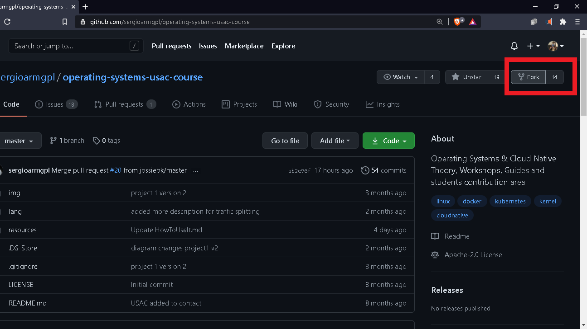
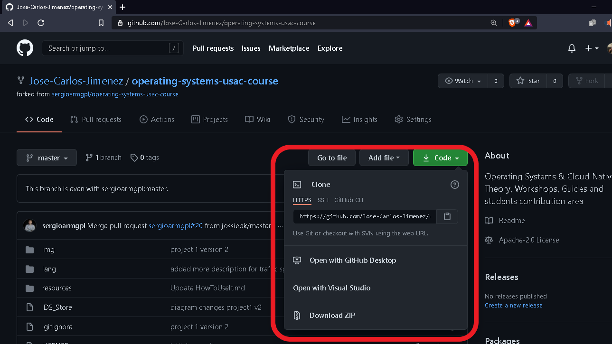
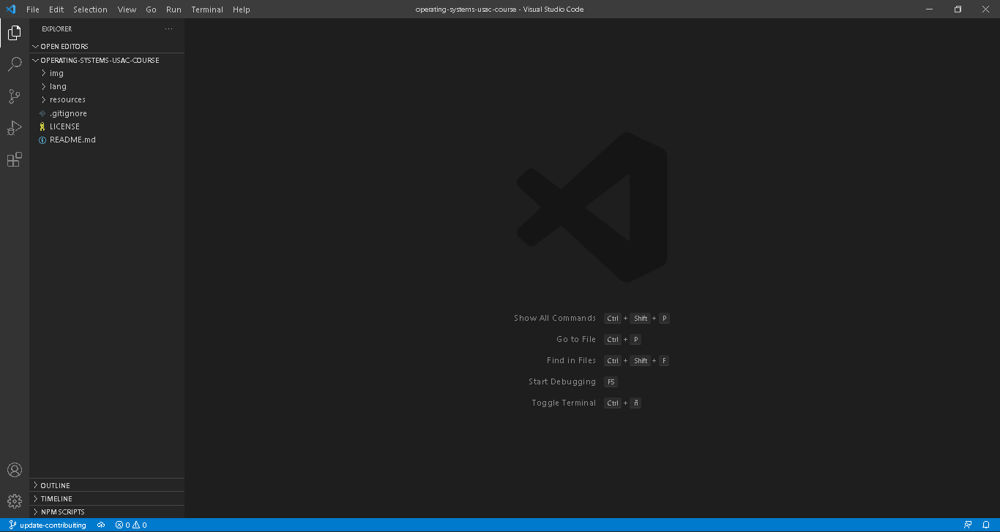
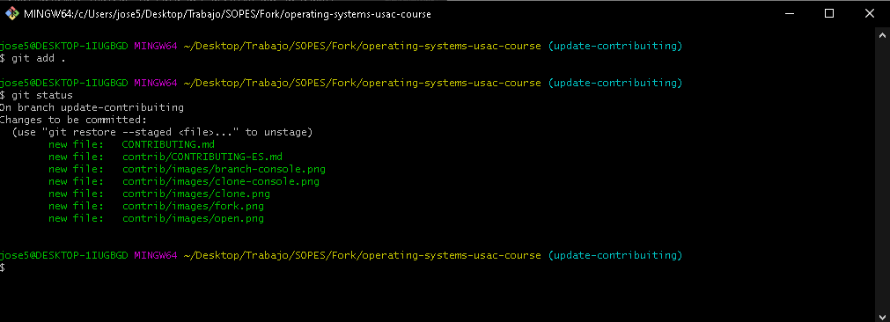
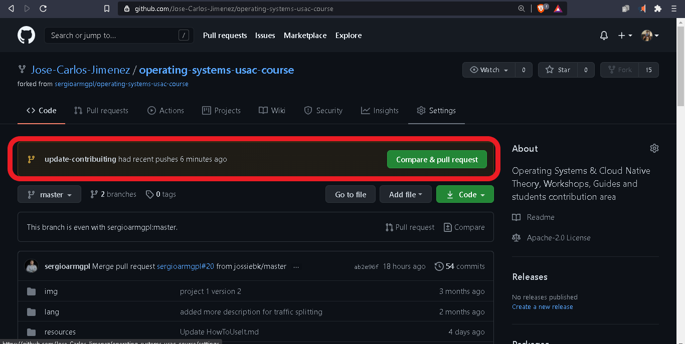

<center>
    <table>
        <tr>
            <td><a href="./CONTRIBUTING.md"> English </a></td>
            <td><a href="./CONTRIBUTING-ES.md"> Español </a></td>
        </tr>
    </table>
</center>

<center> <h1>Guía de contribución</h1> </center>
Esta es una pequeña guía rápida para contribuir en el repositorio y en general en repositorios de código abierto.

Los "Issues" pueden ser emitidos por cualquier persona que lo desee.

Los pasos para realizar un aporte son los siguientes:

### 1. Haz fork del repositorio.
En el repositorio que se desea contribuir existe un botón llamado fork en la parte superior derecha, debes dar clic en este mismo.

En este caso es https://github.com/sergioarmgpl/operating-systems-usac-course.git



### 2. Clona el repositorio de tu perfil de github, es decir tu fork.
Debes clonar el repositorio al que hiciste fork, el cual se encuentra en tu perfil de Github en el área de repositorios.

  


Puedes clonarlo en tu computadora ejecutando el siguiente comando en la carpeta que desees almacenar el proyecto, cabe recalcar que en donde dice youruser debes de colocar tu usuario de Github.

_```git clone https://github.com/youruser/operating-systems-usac-course.git```_

### 3. Crea una rama especifica para el issue especifico en el cual estás trabajando.  
Para esto se utilizará el siguiente comando en tu repositorio local, cabe destacar que "branch-name" puede ser cualquier nombre.

*```git checkout -b update-contribuiting```*  

Se recomienda darle un nombre que inicie con el prefijo **"update-"** si se trata de una nueva característica.
**Por ejemplo:**

*```fix-contribuitingLanguage ```*

En caso de ser un arreglo de bug se recomienda nombrar a la rama con el prefijo **"fix-"** seguido del nombre.  
**Por ejemplo:**

*```fix-contribuitingLanguage ```*


### 4. Inicializa el proyecto en tu editor de código favorito y haz el cambio en los archivos en los que deseas contribuir.
En esta ocasión utilizaremos Visual Studio Code, pero puede ser cualquiera.

También puedes crear nuevos archivos en las carpetas que desees.




### 5. Añade a tu rama los cambios realizados.
Para ver los cambios que has hecho puedes utilizar *```git status ```* en el que visualizaras los archivos que has modificado o añadido.

Puedes añadir archivo por archivo con el comando, en el cual debemos indicar la ruta del archivo que deseamos aportar.

*``` git add path/to/filename.txt```*

También puedes añadir todos los archivos a los que les hayas hecho cambios mediante el comando 

*``` git add .```*



### 6. Has commit de tus cambios.
En este punto confirmaras que los cambios que haz realizado son correctos y están listos para ir a producción.

Esto se realiza mediante el comando:

*```git commit -m "A description about commited changes"```*


### 7. Sube tus cambios al repositorio en la nube.

Aquí subiras a tu usuario de github los cambios que has realizado mediante el comando

*```git push -u origin branch-name```*


### 8. Crea un pull request 
Debes visitar el repositorio al que has hecho fork en tu perfil, en esta sección Github te mostrará un mensaje sugiriendo realizar un solicitud de pull request, en este caso damos clic en esta y nos pedirá un mensaje, en este caso se recomienda hacer el commit en idioma inglés e indicar el Issue al cual se esta atendiendo.

**Por ejemplo:**
_```Closes #42```_
  


